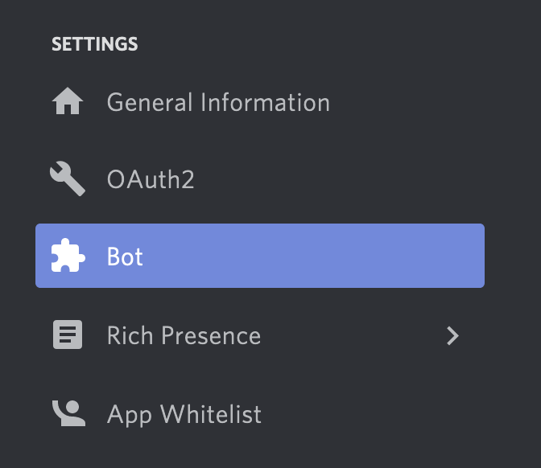
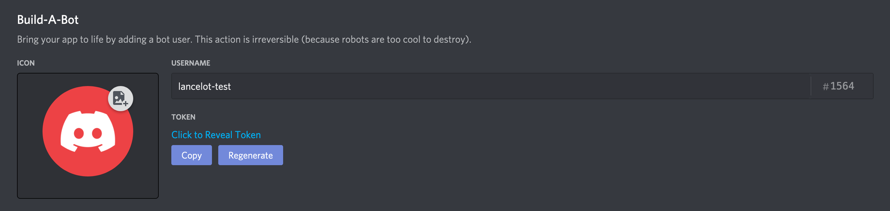
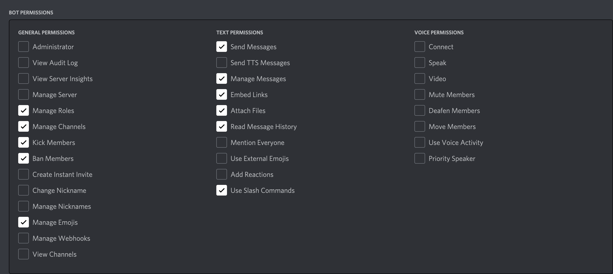

# Lancelot

This repository contains the source code for Knight Hacks' Discord bot!

## Getting Started

### Get the Code

You'll need [`git`](https://git-scm.com/downloads) in order to run the command
below.

```bash
git clone https://github.com/KnightHacks/DiscordBot-New.git
```

### Build the Project

We use [Docker](https://www.docker.com/get-started) to build and deploy this
project. Once you've installed Docker, you should be able to build the project using:

```bash
docker build -t lancelot .
```

Then use:

```bash
docker run lancelot
```

to start the project. You can repeat these commands each time you want to build
and run an updated version of the code.

**This won't work the first time you run this!** You need to get a _token_ to
deploy your instance of the bot to a test server.

### Get a Token

You'll need a token in order to allow your bot to connect to Discord. Go to the
[Discord Developer Portal](https://discord.com/developers) to set up your
developer account. You will need to click "New Application" and follow the
prompts to set up your own test instance of Lancelot.

Once you've set up your test instance of the bot, you'll need to set up a test
bot user. Click "Bot" with the puzzle piece on the left side of the screen.



You should now be able to copy your token from the middle of the screen.
**Don't share this!** Anyone who has this token can control your bot account
and attach other bots to it or worse. Never publish it to source control
software like Git or GitHub.



Create a file called `.env` in the root of the project folder with the token.
This file should be automatically ignored by the Git configuration.

```bash
echo "DISCORD_TOKEN=YOUR_TOKEN_HERE" > .env
```

### Set up Permissions

Finally, you'll need to give your test bot the appropriate permissions so it
can do things. First, on the "Bot" page, turn **on** the "Server Members
Intent" option under "Privileged Gateway Intents".

Next, go to the OAuth2 page and **select "bot" under "Scopes"**. A bunch of
permissions should appear below; the following are recommended settings for the
bot permissions:



Discord will generate an link on the screen which you can use to add the bot to
a server. The simplest thing to do is to make your own testing server and then
follow the link, which will prompt you to add the bot to a server you
administer.

### Run the Bot

Now, you should be able to build and run the bot locally. It will connect to
the server you added it to above and should be interactive!

```bash
docker build -t lancelot .
docker run lancelot
```

The final command should hang with no immediate output if it is working
properly. You can use `control-c` to terminate the bot.

Try sending a `!help` message in your server to test the bot!

Each time you make changes to the bot's code, you will need to rerun the above
to rebuild the bot.

Happy hacking!

## License

AGPL 3.0

Click the `LICENSE` file in the code above for details about what this means.
By contributing to this repository, you agree to license your code under this
license.
